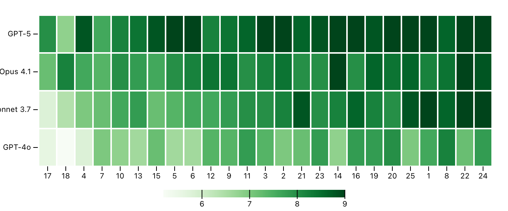

# Sample Heatmap – Inspect Viz

This example illustrates the code behind the [sample_heatmap()](../../../view-sample-heatmap.html.md) pre-built view function. If you want to include this plot in your notebooks or websites you should start with that function rather than the lower-level code below.

    Code

``` python
from inspect_viz import Data
from inspect_viz.plot import plot, legend
from inspect_viz.mark import cell, text
from inspect_viz.transform import avg
from inspect_ai.analysis import samples_df,SampleSummary, EvalModel
from inspect_ai.analysis import prepare, model_info, log_viewer


1samples_data = Data.from_file("writing_bench_samples.parquet")

2channels = {
    "Model": "model_display_name",
    "Score": "score_multi_scorer_wrapper",
    "Log viewer": "log_viewer"
}

plot(
3    cell(
        samples_data,
        x="id",
        y="model_display_name",
4        fill="score_multi_scorer_wrapper",
        channels=channels,
        tip=True,
        inset=1, 
        sort={
5            "y": {  "value": "fill",
                    "reduce": "sum",
                    "reverse": True
                },
6            "x": {  "value": "fill",
                    "reduce": "sum",
                    "reverse": False
                }
        }   
    ),
    padding=0,
    color_scheme="greens",
    height=250,
    margin_left=50,
    x_label=None,
    y_label=None,
    x_scale="band",
    legend=legend("color", frame_anchor="bottom", border=False)

)
```

1  
Read the data (the parquet file was generated using `samples_df` with [SampleSummary](https://inspect.aisi.org.uk/reference/inspect_ai.analysis.html#samplesummary) and [EvalModel](https://inspect.aisi.org.uk/reference/inspect_ai.analysis.html#evalmodel) column definitions.)

2  
Channels are used to customize what is display in the tooltip for each cell.

3  
Use a cell mark to create each colored cell.

4  
The fill is used to compute the color for each cell.

5  
Sorts the y-axis by the total score for each model, with the highest score at the top.

6  
Sorts the x-axis by the total score for each question, witht he highest score at the right.


