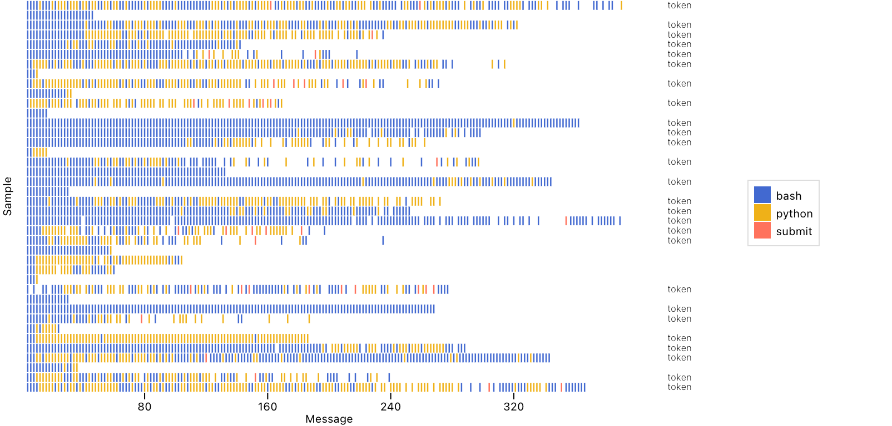

# Sample Tool Calls – Inspect Viz

This example illustrates the code behind the [sample_tool_calls()](../../../reference/inspect_viz.view.html.md#sample_tool_calls) pre-built view function. If you want to include this plot in your notebooks or websites you should start with that function rather than the lower-level code below.

The plot visualizes tool usage over a series of turns in a Cybench evaluation. We use a [cell()](../../../reference/inspect_viz.mark.html.md#cell) mark to visualize tool use over messages in each sample of an evaluation. We note any limit that ended the sample using a [text()](../../../reference/inspect_viz.mark.html.md#text) mark on the right side of the frame.

    Code

``` python
from inspect_viz import Data
from inspect_viz.plot import plot, legend
from inspect_viz.mark import cell, text
from inspect_viz.transform import first

# read data (see 'Data Preparation' below)
1data = Data.from_file("cybench_tools.parquet")

tools = ["bash", "python", "submit"]

plot(
2    cell(
        data,
        x="order",
        y="id",
        fill="tool_call_function"
    ),
    
3    text(
        data, 
        text=first("limit"), 
        y="id",
        frame_anchor="right", 
        font_size=8, 
        font_weight=200,
        dx=50
    ),
    legend=legend("color", frame_anchor="right"),
4    margin_top=0,
    margin_left=20,
    margin_right=100,
5    x_ticks=list(range(0, 400, 80)),
    y_ticks=[],
6    x_label="Message",
    y_label="Sample",
    color_label="Tool",
7    color_domain=tools
)
```

1  
Read tool call data (see [Data Preparation](../../../view-sample-tool-calls.html.md#data-preparation) for details).

2  
[cell()](../../../reference/inspect_viz.mark.html.md#cell) mark showing tool calls.

3  
[text()](../../../reference/inspect_viz.mark.html.md#text) mark showing whether the sample terminated due to a limit.

4  
Tweak the margins so the axis labels and text annotations appear correctly.

5  
Reduce the number of tick marks on the x-axis and eliminate y-ticks.

6  
Set some custom labels and ensure that tools follow our designed order.

7  
Specify which tools we should show and in what order.


