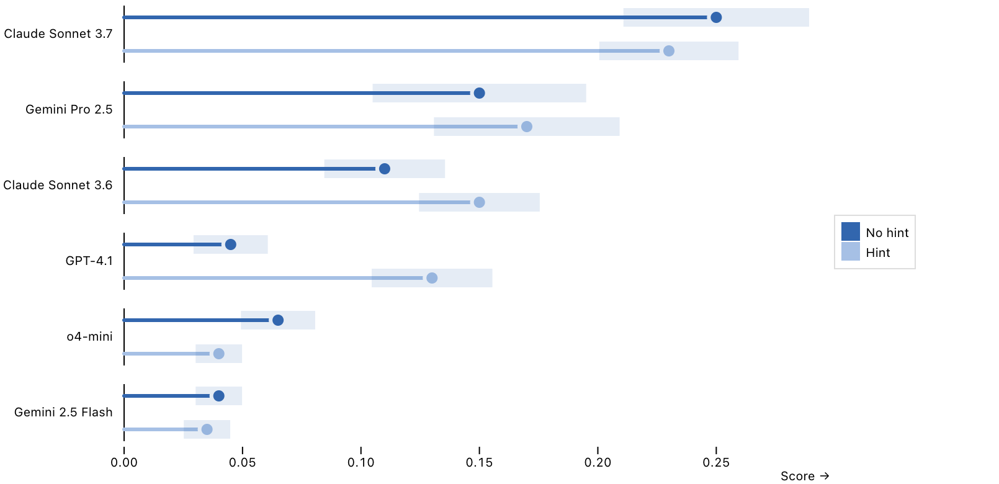

# Scores by Factor – Inspect Viz

This example illustrates the code behind the [scores_by_factor()](../../../view-scores-by-factor.html.md) pre-built view function. If you want to include this plot in your notebooks or websites you should start with that function rather than the lower-level code below.

    Code

``` python
from inspect_viz import Data
from inspect_viz.mark import frame, rule_y
from inspect_viz.plot import legend, plot
from inspect_viz.transform import ci_bounds, sql

evals = Data.from_file("evals.csv")

# factor colors/labels
1fx_colors = ["#3266ae", "#a6c0e5"]
fx_labels = ["No hint", "Hint"]

# confidence interval tranforms
ci_lower, ci_upper = ci_bounds(
    score="score_headline_value", 
    level=0.95,
    stderr="score_headline_stderr"
)

# compute plot height (65 pixels per model)
2height = 65 * len(evals.column_unique("model_display_name"))

plot(
3    frame("left", inset_top=5, inset_bottom=5),
    rule_y(
        evals,
        x="score_headline_value",
        y="task_arg_hint",
        fy="model_display_name",
4        sort={"fy": "-x"},
        stroke=sql(f"IF(NOT task_arg_hint, '{fx_labels[0]}', '{fx_labels[1]}')"), 
        stroke_width=3,
        stroke_linecap="round",
        marker_end="circle",
        tip=True,
        channels={
            "Model": "model_display_name", 
            "Hint": "task_arg_hint",
            "Score": "score_headline_value", 
            "Stderr": "score_headline_stderr"
        },
    ),
    rule_y(
        evals,
5        x1=ci_lower,
        x2=ci_upper,
        y="task_arg_hint",
        fy="model_display_name",
        stroke=f"{fx_colors[0]}20",
        stroke_width=15,
    ),
6    legend=legend("color", target=evals.selection),
    x_label="Score",
7    y_label=None,
    y_ticks=[],
    y_tick_size=0,
    fy_label=None,
    fy_axis="left",
8    color_domain=fx_labels,
    color_range=fx_colors,
    margin_top=0,
9    margin_left=100,
    height=height
)
```

1  
Factors need to define a dark/light color and labels for the their `False` and `True` states.

2  
Compute plot height based on number of unique models.

3  
Sets off each model with their own horizonal axis line.

4  
Order models on y axis from highest to lowest score.

5  
Confidence interval using specified stderr column.

6  
Clickable legend to filter view by factor value.

7  
Y-axis labels and ticks already covered by factor and [frame()](../../../reference/inspect_viz.mark.html.md#frame).

8  
Map legend and colors map to factor.

9  
Leave room for model names.


