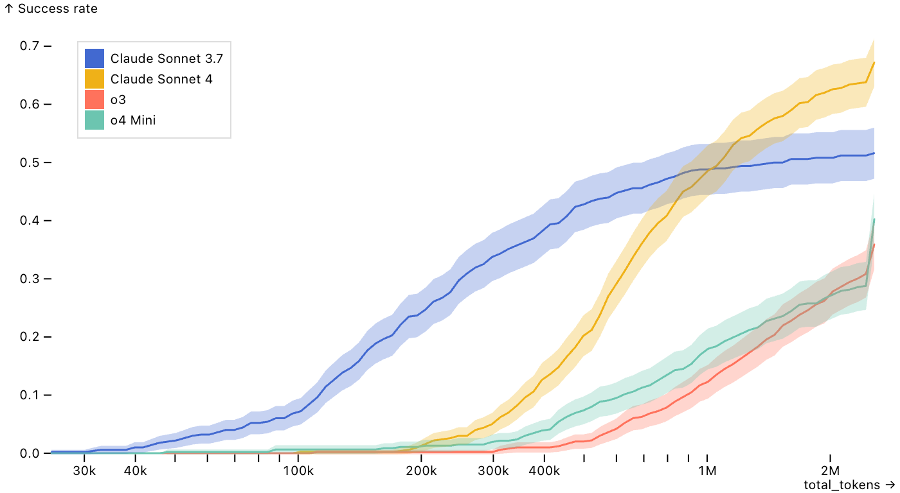

# Scores by Limit – Inspect Viz

This example illustrates the code behind the [scores_by_limit()](../../../view-scores-by-limit.html.md) pre‑built view function. If you want to include this plot in your notebooks or sites, start with that function rather than the lower‑level code below.

The plot shows how model **success rate** changes as the **compute budget** increases (e.g., token limit, messages, cost, or time). It helps answer “*Will performance keep improving if I spend more?*”. The shaded band displays the confidence interval derived from the standard error.

    Code

``` python
from inspect_viz import Data, Selection
from inspect_viz.mark import area_y, line
from inspect_viz.plot import plot, legend
from inspect_viz.transform import sql, ci_bounds
from inspect_viz.interactor import highlight, nearest_x
from inspect_viz._util.stats import z_score

# read data (see 'Data Preparation' below)
1data = Data.from_file("swebench_token_limit.parquet")

2channels = {
    "Token Limit": "total_tokens",
    "Success Rate": "success_rate",
    "Model": "model_display_name",
    "Log": "log_viewer"
}

# confidence interval
3ci_lower, ci_upper = ci_bounds("success_rate", level=0.95, stderr="standard_error")

# enable interactive highlighting of a chosen model
4selection = Selection.single()

components = [
    # success-rate lines by model (optionally faceted by difficulty)
5    line(
        data, 
        x="total_tokens", 
        y="success_rate", 
        stroke="model_display_name", 
        tip=True, 
        channels=channels
    ),

    # confidence band from mean ± z * stderr
6    area_y(
        data,
        x="total_tokens",
        y="success_rate",
        y1=ci_lower,
        y2=ci_upper,
        color="model_display_name",
        fill="model_display_name",
        fill_opacity=0.3,
        tip=False
    ),


    # interactions: snap by nearest x and highlight selection
7    nearest_x(target=selection, channels=["color"]),
    highlight(by=selection, opacity=0.2, fill_opacity=0.1),
]

plot(
    components,
8    x_label="total_tokens",
    y_label="Success rate",
    legend=legend("color", frame_anchor="top-left", inset=20),
9    x_scale="log",
    # layout tweaks
10    y_inset_top=10,
    margin_bottom=30,
    # dimensions
11    width=700,
)
```

1  
**Load data** from a Parquet file into an `inspect_viz.Data` table.

2  
**Channels** provide readable names for tooltips and the log viewer.

3  
**Confidence interval**: choose a value like `0.80`, `0.90`, or `0.95`; it’s converted to a z‑score for the shaded band.

4  
**Selection** enables interactive hovering/clicking to emphasize a single model.

5  
**[line()](../../../reference/inspect_viz.mark.html.md#line) mark** draws success‑rate curves with tooltips.

6  
**[area_y()](../../../reference/inspect_viz.mark.html.md#area_y)** adds a CI band using `mean ± z * stderr` if `standard_error` is present.

7  
**Interactions**: [nearest_x()](../../../reference/inspect_viz.interactor.html.md#nearest_x) snaps the selection to the closest x, and [highlight()](../../../reference/inspect_viz.interactor.html.md#highlight) dims the rest.

8  
**Labels**: x uses the field name; y is set explicitly (pass `None` to hide).

9  
**Log scale** for the budget axis to better separate small and large limits.

10  
**Layout**: small top inset avoids clipping; extra bottom margin leaves room for the legend.

11  
**Size**: default width is 700px; height defaults to the golden ratio (`width / 1.618`).



## Data Preparation

The data dataset for this example was created using the [scores_by_limit_df()](../../../reference/inspect_viz.view.html.md#scores_by_limit_df) function, which reads per-sample metadata, computes token usage, and aggregates a success rate as a function of a limit threshhold.

Above we read the data for the plot from a parquet file. This file was in turn created by:

1.  Reading sample level data into a data frame with [samples_df()](https://inspect.aisi.org.uk/reference/inspect_ai.analysis.html#evals_df). In addition to the base sample information, we also read eval specific columns using [EvalInfo](https://inspect.aisi.org.uk/reference/inspect_ai.analysis.html#evalinfo) and [EvalModel](https://inspect.aisi.org.uk/reference/inspect_ai.analysis.html#evalmodel).

2.  Converting the samples dataframe into a dataframe specifically used by [scores_by_limit()](../../../reference/inspect_viz.view.html.md#scores_by_limit) by using the [scores_by_limit_df()](../../../reference/inspect_viz.view.html.md#scores_by_limit_df) function.

3.  Using the [prepare()](https://inspect.aisi.org.uk/reference/inspect_ai.analysis.html#prepare) function to add [model_info()](https://inspect.aisi.org.uk/reference/inspect_ai.analysis.html#model_info) and [log_viewer()](https://inspect.aisi.org.uk/reference/inspect_ai.analysis.html#model_info) columns to the data frame.

Here is the data preparation code end-to-end:

``` python
from inspect_ai.analysis import (
    EvalInfo, EvalModel, SampleSummary,
    log_viewer, model_info, prepare, samples_df
)
from inspect_viz.view import scores_by_limit_df

1df = samples_df(
    [
    "logs/swe-bench/"],
2    columns=SampleSummary + EvalInfo + EvalModel,
)

3df = scores_by_limit_df(
    df,
    score="score_swe_bench_scorer",
)

4df = prepare(df, [
  model_info(),
  log_viewer("eval", { "logs": "https://samples.meridianlabs.ai/" })
])

df.to_parquet("swebench_token_limit.parquet")
```

1  
Read the samples data info a dataframe.

2  
Be sure to specify the [SampleSummary](https://inspect.aisi.org.uk/reference/inspect_ai.analysis.html#samplesummary), [EvalInfo](https://inspect.aisi.org.uk/reference/inspect_ai.analysis.html#evalinfo), and [EvalModel](https://inspect.aisi.org.uk/reference/inspect_ai.analysis.html#evalmodel) columns.

3  
Convert the base dataframe into a [scores_by_limit()](../../../reference/inspect_viz.view.html.md#scores_by_limit) specific dataframe.

4  
Add pretty model names and log links to the dataframe.
