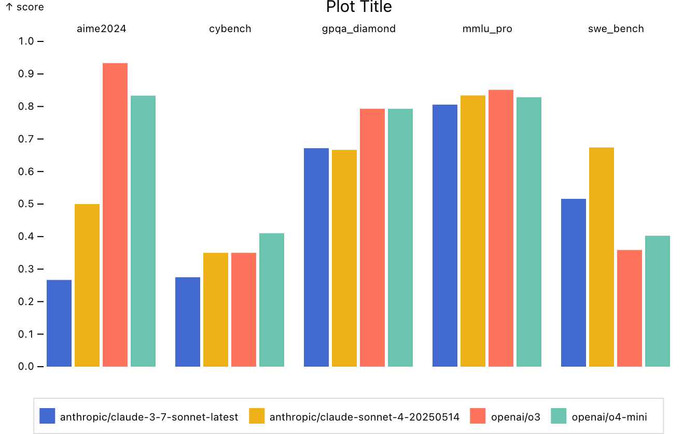
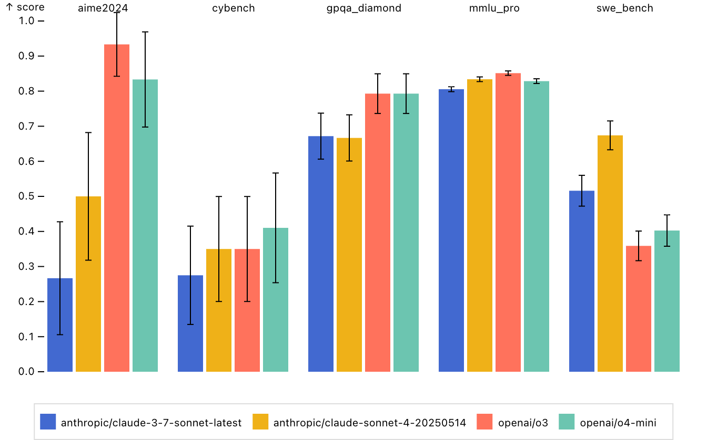

# Scores by Task – Inspect Viz

This example illustrates the code behind the [scores_by_task()](../../../view-scores-by-task.html.md) pre-built view function. If you want to include this plot in your notebooks or websites you should start with that function rather than the lower-level code below.

    Code

``` python
from inspect_viz import Data
from inspect_viz.plot import plot, legend
from inspect_viz.mark import bar_y, TipOptions, text, title
from inspect_viz.transform import sql

evals = Data.from_file("evals.parquet")

plot(
    bar_y( 
        evals, 
        x="model", 
1        fx="task_name",
        y="score_headline_value",
2        channels= { "Log Viewer": "log_viewer" },
        fill="model",
        tip=True
    ),
    title=title("Plot Title", margin_top=40),
    legend=legend("color", frame_anchor="bottom"),
3    x_label=None, fx_label=None, x_ticks=[],
4    y_label="score", y_domain=[0, 1.0],
    color_label="Model"
)
```

1  
Facet the x-axis (i.e. create multiple groups of bars) by task name.

2  
Add a channel with links to the Inspect log files (links appear in the tooltip).

3  
We don’t need an explicit “model” or “task_name” label as they are obvious from context. We also don’t need ticks b/c the fill color and legend provide this.

4  
Ensure that y-axis shows the full range of scores (by default it caps at the maximum).



#### Confidence Interval

Here we add a confidence interval for each reported score by adding a [rule_x()](../../../reference/inspect_viz.mark.html.md#rule_x) mark. Note that we derive the confidence interval transforms using the [ci_bounds()](../../../reference/inspect_viz.transform.html.md#ci_bounds) function.

    Code

``` python
from inspect_viz.mark import rule_x
from inspect_viz.transform import sql, ci_bounds

1# confidence interval bounds
ci_lower, ci_upper = ci_bounds(
    score="score_headline_value", 
    level=0.95, 
    stderr="score_headline_stderr"
)

plot(
    bar_y( 
        evals, x="model", fx="task_name", 
        y="score_headline_value",
        channels= { "Log Viewer": "log_viewer" },
        fill="model",
        tip=True
    ),
2    rule_x(
        evals,
        x="model",
        fx="task_name",
        y1=ci_lower,
        y2=ci_upper,
        stroke="black",
        marker="tick-x",
    ),
    legend=legend("color", frame_anchor="bottom"),
    x_label=None, fx_label=None, x_ticks=[],
    y_label="score", y_domain=[0, 1.0],
    color_label="Model"
)
```

1  
Use the [ci_bounds()](../../../reference/inspect_viz.transform.html.md#ci_bounds) bounds function to create transforms that we will pass for `y1` and `y2`.

2  
Draw the confidence interval using a [rule_x()](../../../reference/inspect_viz.mark.html.md#rule_x) mark.


