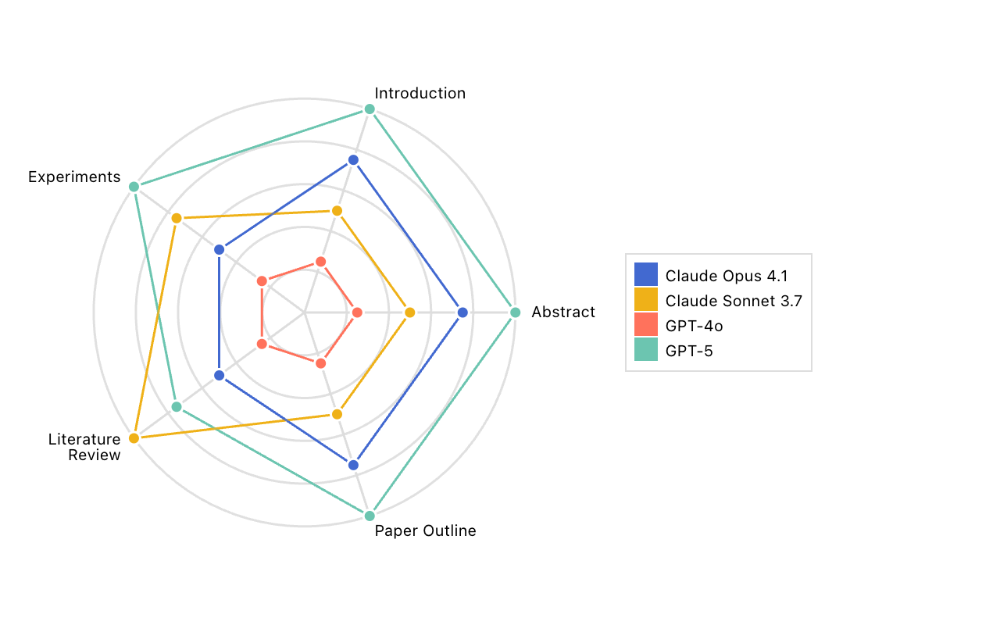

# Scores Radar By Metric – Inspect Viz

This example illustrates the code behind the [`scores_radar_by_metric()`](../../../view-scores-radar-by-metric.html.md) pre‑built view function. If you want to include this plot in your notebooks or sites, start with that function rather than the lower‑level code below.

`scores_radar_by_metric()` is useful to compare scores across multiple models and metrics from a single task with composite metrics. The data preparation function scales values for visualization purposes by normalizing them using percentile ranks or min-max normalization, the raw values are displayed in the tooltips.

    Code

``` python
from inspect_viz import Data, Selection
from inspect_viz.mark import circle, line, text
from inspect_viz.plot import legend, plot
from inspect_viz.view import LabelStyles
from inspect_viz.view._scores_radar import (
    axes_coordinates,
    grid_circles_coordinates,
    labels_coordinates,
)


1data = Data.from_file("writing_bench.parquet")

2channels = {
    "Model": "model_display_name",
    "Metric": "metric",
    "Score": "value",
    "Log viewer": "log_viewer",
}

metrics = data.column_unique("metric")
3axes = axes_coordinates(num_axes=len(metrics))
grid_circles = grid_circles_coordinates()
labels = labels_coordinates(labels=metrics)

# enable interactive highlighting of a chosen model
4model_selection = Selection.single()

elements = [
5    *[
        line(
            x=data["x"],
            y=data["y"],
            stroke="#e0e0e0",
        )
        for data in grid_circles
    ],
6    line(
        x=axes["x"],
        y=axes["y"],
        stroke="#ddd",
    ),
7    line(
        data,
        x="x",
        y="y",
        stroke="model_display_name",
        filter_by=model_selection,
        tip=True,
        channels=channels,
    ),
    line(
        data,
        x="x",
        y="y",
        stroke="model_display_name",
        stroke_opacity=0.4,
        tip=False,
    ),
8    circle(
        data,
        x="x",
        y="y",
        r=4,
        fill="model_display_name",
        stroke="white",
        filter_by=model_selection,
        tip=False,
    ),
    # axis labels
9    *[
        text(
            x=label["x"],
            y=label["y"],
            text=label["label"],
            frame_anchor=label["frame_anchor"],
            styles=LabelStyles(line_width=8),
        )
        for label in labels
    ],
]

plot(
    elements,
    margin=60,
10    x_axis=False,
    y_axis=False,
    width=400,
    height=400,
11    legend=legend("color", target=model_selection),
)
```

1  
**Load data** from a Parquet file into an `inspect_viz.Data` table.

2  
**Channels** provide readable names for tooltips and the log viewer.

3  
**Coordinates**: compute coordinates for axes, grid circles, and labels.

4  
**Selection** enables interactive hovering/clicking to emphasize a single model.

5  
**Grid lines [line()](../../../reference/inspect_viz.mark.html.md#line) mark** draws grid circles.

6  
**Axes spokes [line()](../../../reference/inspect_viz.mark.html.md#line) mark** draws axes.

7  
**Polygon outlines [line()](../../../reference/inspect_viz.mark.html.md#line) mark** draws polygon outlines.

8  
**Polygon vertex markers [circle()](../../../reference/inspect_viz.mark.html.md#circle) mark** draws polygon vertex markers.

9  
**Axis labels [text()](../../../reference/inspect_viz.mark.html.md#text) mark** draws axis labels.

10  
**Layout** draws the plot with no axes since axes are arbitrary scalers in the radar chart.

11  
**Legend** draws a legend for the model selection.



## Data Preparation

The data dataset for this example was created using the `scores_radar_by_metric_df()` function, which reads evals metadata, scales scores by percentile ranks or min-max normalization, and computes coordinates for the radar chart.

Above we read the data for the plot from a parquet file. This file was in turn created by:

1.  Reading evals level data into a data frame with [evals_df()](https://inspect.aisi.org.uk/reference/inspect_ai.analysis.html#evals_df).

2.  Converting the evals dataframe into a dataframe specifically used by `scores_radar_by_metric()` by using the `scores_radar_by_metric_df()` function. The output of `scores_radar_by_metric_df()` can be directly passed to `scores_radar_by_metric()`. `scores_radar_by_metric_df()` expects a scorer name, an optional list of metric names to visualize, an optional list of metric names to invert where lower scores correspond to better scores, an optional normalization method to scale scores, and an optional min-max domain to use for normalization on the radar chart.

3.  Using the [prepare()](https://inspect.aisi.org.uk/reference/inspect_ai.analysis.html#prepare) function to add [model_info()](https://inspect.aisi.org.uk/reference/inspect_ai.analysis.html#model_info) and [log_viewer()](https://inspect.aisi.org.uk/reference/inspect_ai.analysis.html#model_info) columns to the data frame.

Here is the data preparation code end-to-end:

``` python
from inspect_ai.analysis import (
    evals_df,
    log_viewer,
    model_info,
    prepare,
)
from inspect_viz.view import scores_radar_by_metric_df


1df = evals_df("logs/writing_bench/")

2df = scores_radar_by_metric_df(
    df,
3    scorer="multi_scorer_wrapper",
4    metrics=[
        "Abstract",
        "Introduction",
        "Experiments",
        "Literature Review",
        "Paper Outline",
    ],
5    normalization="percentile",
)

6df = prepare(df, [
    model_info(),
    log_viewer("eval", { "logs": "https://samples.meridianlabs.ai/" })
])

df.to_parquet("writing_bench.parquet")
```

1  
Read the evals data into a dataframe.

2  
Convert the dataframe into a `scores_radar_by_metric()` specific dataframe.

3  
A task might have multiple scorers, specify the scorer which you want to plot. The function only supports plotting one scorer at a time. The scorer name should correspond to columns in `df` named `score_{scorer}_{metric}`.

4  
Specify a list of metrics to plot on the radar chart. If unspecified, all metrics from a scorer will be plotted. Metric names in the list should correspond to columns in `df` named `score_{scorer}_{metric}`.

5  
Choose an optional normalization method to scale the raw scores. Available options: `"percentile"` (computes percentile rank, useful for identifying consistently strong performers), `"min_max"` (scales scores between min-max values, sensitive to outliers), or `"absolute"` (default, no normalization, may result in incomprehensible charts if metrics have different scales).

6  
Add pretty model names and log links to the dataframe using [prepare()](https://inspect.aisi.org.uk/reference/inspect_ai.analysis.html#prepare).
