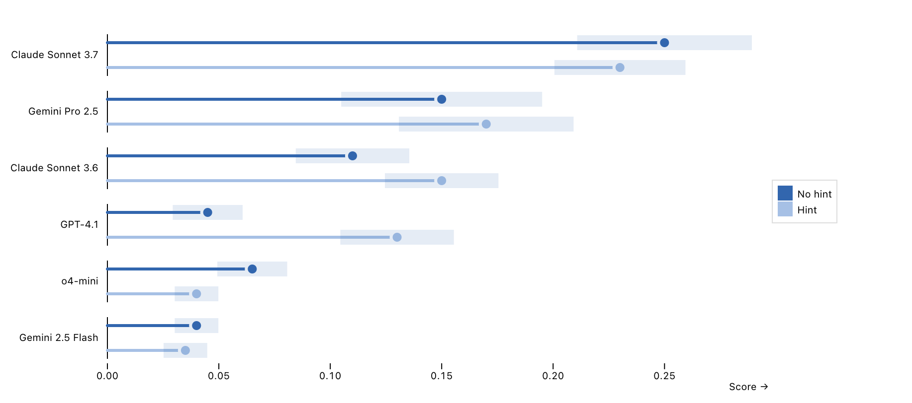

# PNG Output – Inspect Viz

## Overview

When publishing a [notebook](./publishing-notebooks.html.md), [website](./publishing-websites.html.md), or [dashboard](./publishing-dashboards.html.md), Inspect Viz plots are rendered by default as Jupyter Widgets that use JavaScript to provide various interactive features (tooltips, filtering, brushing, etc.). While this is the recommended way to publish Inspect Viz content, you can also choose to render content as static PNG images.

You might want do this if you are creating an Office or PDF document from a notebook, or want plots in a dashboard to be available even when disconnected from the Internet. Note however that rendering plots as PNG images does take longer than the native JavaScript output format, and that interactive features are not available in this mode.

#### Prerequisites

To create PNG output with Inspect Viz, first install the [playwright](https://playwright.dev/python/) Python package, which enables taking screenshots of web graphics using an embedded version of the Chromium web browser. You can do this as follows:

``` bash
pip install playwright
playwright install
```

## Standalone

Use the [write_png()](./reference/inspect_viz.plot.html.md#write_png) function to save a stanalone PNG version of any plot. For example:

``` python
from inspect_viz import Data
from inspect_viz.mark import dot
from inspect_viz.plot import plot, write_png

penguins = Data.from_file("penguins.parquet")

pl = plot(
    dot(penguins, x="body_mass", y="flipper_length",  
        stroke="species", symbol="species"),
    legend="symbol",
    grid=True
)

write_png("penguins.png", pl)
```

## Embedded

When your plots are embedded in a notebook or website, use the global `output_format` option to specify that you’d like to render them in PNG format. For example, the plot below is rendered as a static PNG graphic:

``` python
from inspect_viz import Data, options
from inspect_viz.view import scores_by_factor

1# set 'png' as default output format
options.output_format = "png"

# render plot
evals = Data.from_file("evals-hint.parquet")
scores_by_factor(evals, "task_arg_hint", ("No hint", "Hint"))
```

1  
Set the global `options.output_format` option to render all plots in a notebook or Quarto document as static PNG images.

[](publishing-png-output_files/figure-html/cell-2-output-1.png)

You can also do this for a single plot or set of plots using [options_context()](./reference/inspect_viz.html.md#options_context):

``` python
from inspect_viz import options_context

with options_context(output_format="png"):
    # plot code here
```

Note that when rendering a PDF document with Quarto, the output format is automatically set to “png” (as PDFs can’t ever include interactive JavaScript content).

## PNG Fallback

Inspect Viz plots can also be rendered in a hybrid mode where a static PNG is embedded as a fallback and the interactive widget is overlaid on top once the JavaScript pipeline loads. If anything in the pipeline fails — for example, the user is on a restrictive network that blocks the jsDelivr CDN, or DuckDB-WASM can’t initialize — the PNG remains visible and the page stays readable.

This is especially valuable for sites that need to degrade gracefully in corporate networks, archival contexts, or offline viewing.

### Enabling Fallback

The hybrid mode is opt-in. The cleanest way to enable it for production renders — without affecting `quarto preview` / dev iteration — is via a [Quarto profile](https://quarto.org/docs/projects/profiles.html) that sets the `INSPECT_VIZ_OUTPUT_FORMAT` environment variable.

Add an `_environment-publish` file at the root of your Quarto project:

    _environment-publish

``` bash
INSPECT_VIZ_OUTPUT_FORMAT=js+png
```

Then activate the `publish` profile when you’re ready to ship. The `--profile` flag works for both `quarto render` (build locally) and `quarto publish` (build + deploy):

``` bash
# build the site locally
quarto render --profile publish

# build and deploy in one step (Quarto Pub, GitHub Pages, Netlify, etc.)
quarto publish --profile publish
```

During `quarto preview` (or a plain `quarto render` / `quarto publish` with no profile) the env var isn’t applied, so no PNG fallbacks are generated and dev iteration stays fast. Only your published build pays the per-plot Playwright cost.

You can also enable it ad-hoc with the env var directly:

``` bash
INSPECT_VIZ_OUTPUT_FORMAT=js+png quarto render
```

Or programmatically in a notebook / document with `options.output_format = "js+png"` or `options_context(output_format="js+png")`.

Widgets that contain inputs (tables, selects, checkbox groups, etc.) are skipped — a static picture of an interactive control isn’t a useful fallback — and those widgets render with the standard loading shimmer.
