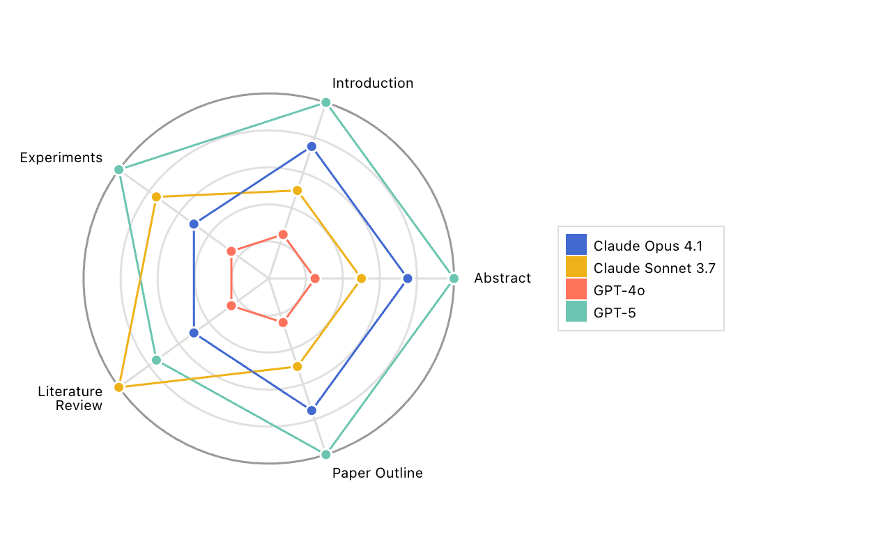

# Scores Radar By Metric – Inspect Viz

## Overview

The `scores_radar_by_metric()`function renders a radar chart for comparing model scores across multiple metrics from a single task. This is useful for tasks with composite metrics, where each metric is a separate axis on the radar chart.

``` python
from inspect_viz import Data
from inspect_viz.view import scores_radar_by_metric

evals = Data.from_file("writing_bench_radar.parquet")
scores_radar_by_metric(evals)
```



The scores plotted on this radar chart have been normalized using percentile ranking, which means each score represents the model’s relative performance compared to all other models in the dataset. Specifically, a score of 0.5 indicates that the model performed better than 50% of the other models. Absolute scores are displayed in the tooltips.

You can use `scores_radar_by_metric_df()` to produce data with min-max normalization, omit normalization entirely, or invert the scores for metrics where lower scores are better.

## Data Preparation

Above we read the data for the plot from a parquet file. This file was in turn created by:

1.  Reading evals level data into a data frame with [evals_df()](https://inspect.aisi.org.uk/reference/inspect_ai.analysis.html#evals_df).

2.  Converting the evals dataframe into a dataframe specifically used by `scores_radar_by_metric()` by using the `scores_radar_by_metric_df()` function. The output of `scores_radar_by_metric_df()` can be directly passed to `scores_radar_by_metric()`. `scores_radar_by_metric_df()` expects a scorer name, an optional list of metric names to visualize, an optional list of metric names to invert where lower scores correspond to better scores, an optional normalization method to scale scores, and an optional min-max domain to use for normalization on the radar chart.

3.  Using the [prepare()](https://inspect.aisi.org.uk/reference/inspect_ai.analysis.html#prepare) function to add [model_info()](https://inspect.aisi.org.uk/reference/inspect_ai.analysis.html#model_info) and [log_viewer()](https://inspect.aisi.org.uk/reference/inspect_ai.analysis.html#model_info) columns to the data frame.

Here is the data preparation code end-to-end:

``` python
from inspect_ai.analysis import (
    evals_df,
    log_viewer,
    model_info,
    prepare,
)
from inspect_viz.view import scores_radar_by_metric_df


1df = evals_df("logs/writing_bench/")

2df = scores_radar_by_metric_df(
    df,
3    scorer="multi_scorer_wrapper",
4    metrics=[
        "Abstract",
        "Introduction",
        "Experiments",
        "Literature Review",
        "Paper Outline",
    ],
5    normalization="percentile",
)

6df = prepare(df, [
    model_info(),
    log_viewer("eval", { "logs": "https://samples.meridianlabs.ai/" })
])

df.to_parquet("writing_bench_radar.parquet")
```

1  
Read the evals data into a dataframe.

2  
Convert the dataframe into a `scores_radar_by_metric()` specific dataframe.

3  
A task might have multiple scorers, specify the scorer which you want to plot. The function only supports plotting one scorer at a time. The scorer name should correspond to columns in `df` named `score_{scorer}_{metric}`.

4  
Specify a list of metrics to plot on the radar chart. If unspecified, all metrics from a scorer will be plotted. Metric names in the list should correspond to columns in `df` named `score_{scorer}_{metric}`.

5  
Choose an optional normalization method to scale the raw scores. Available options: `"percentile"` (computes percentile rank, useful for identifying consistently strong performers), `"min_max"` (scales scores between min-max values, sensitive to outliers), or `"absolute"` (default, no normalization, may result in incomprehensible charts if metrics have different scales).

6  
Add pretty model names and log links to the dataframe using [prepare()](https://inspect.aisi.org.uk/reference/inspect_ai.analysis.html#prepare).

## Function Reference

### scores_radar_by_metric

Creates a radar chart showing scores for multiple models across multiple metrics in a single task.

This is useful for tasks with multiple metrics, where each metric is a separate axis on the radar chart.

[Source](https://github.com/meridianlabs-ai/inspect_viz/blob/35eb8b9c8a42829dae8c1961de42998c0aa31bc6/src/inspect_viz/view/_scores_radar.py#L259)

``` python
def scores_radar_by_metric(
    data: Data,
    label: str = "metric",
    **kwargs: Any,
) -> Component
```

`data` [Data](./reference/inspect_viz.html.md#data)  
A [Data](./reference/inspect_viz.html.md#data) object prepared using the `scores_radar_by_metric_df` function.

`label` str  
Name of field holding the axes labels (defaults to “metric”).

`**kwargs` Any  
Additional arguments for the `scores_radar_by_task` function.

### scores_radar_by_metric_df

Creates a dataframe for a radar chart showing multiple models across multiple metrics in a single task.

This is useful for tasks with multiple metrics, where each metric is a separate axis on the radar chart.

[Source](https://github.com/meridianlabs-ai/inspect_viz/blob/35eb8b9c8a42829dae8c1961de42998c0aa31bc6/src/inspect_viz/view/_scores_radar.py#L160)

``` python
def scores_radar_by_metric_df(
    data: pd.DataFrame,
    scorer: str,
    metrics: list[str] | None = None,
    invert: list[str] | None = None,
    normalization: Literal["percentile", "min_max", "absolute"] = "absolute",
    domain: tuple[float, float] | None = None,
) -> pd.DataFrame
```

`data` pd.DataFrame  
Evals data table containing model scores. It assumes one row per model.

`scorer` str  
The name of the scorer to use for identifying metric columns.

`metrics` list\[str\] \| None  
Optional list of specific metrics to plot. If None, all metrics starting with ’score\_{scorer}\_’ from the data will be used.

`invert` list\[str\] \| None  
Optional list of metrics to invert (where lower scores are better).

`normalization` Literal\['percentile', 'min_max', 'absolute'\]  
The normalization method to use for the metric values. Can be “percentile”, “min_max”, or “absolute”. Defaults to “absolute” (no normalization).

`domain` tuple\[float, float\] \| None  
Optional min-max domain to use for the normalization. Only used if normalization is “min_max”. Otherwise, the domain is inferred from the data. Defaults to None.

## Implementation

The [Scores Radar By Metric](./examples/inspect/scores-radar-by-metric/index.html.md) example demonstrates how this view was implemented using lower level plotting components.
